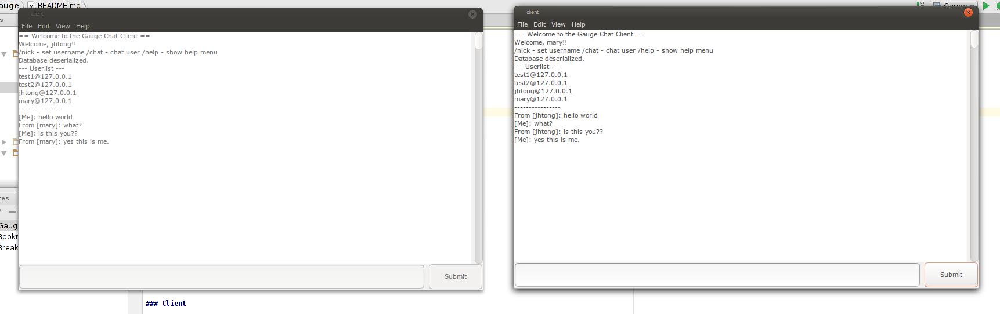
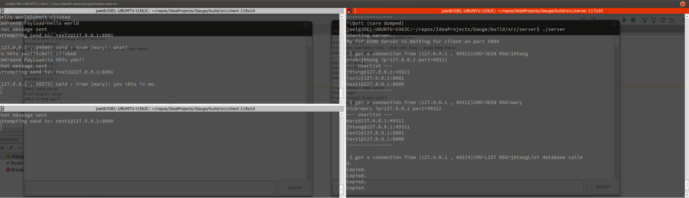

CG3204L Assignment - Gauge Chat Client
=========================================

A0108165J

TONG Haowen Joel

## What is it?

Gauge, a TCP/UDP chat client

Gauge is a UDP Peer-to-peer chat client for talking to anyone anywhere.

## Prerequisites

- Cmake
- GTK3 libraries
- Linux-based system, for <sys/queue.h> linked lists, pthreads, sockets, etc.

## Installation

Gauge uses Cmake and make.  To run, type

    $ mkdir -p build && cd build
    $ cmake .. && make
    
    
## Running

### Server

    $ cd build/src/server && ./server

### Client

    $ cd build/src/client && ./client
    
    
## Organization of libraries

- src
    - client - Client
    - server - server 
    - core - contains core library
    - test - contains test drivers
    - legacy - unused code

